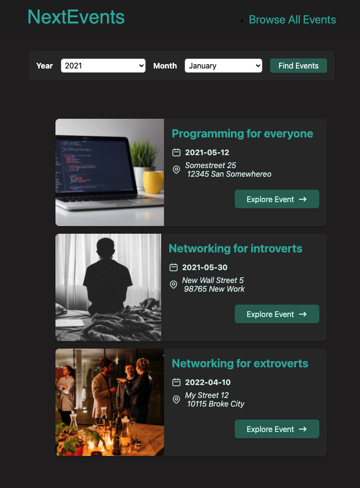

# NextEvents 📅 - This application shows and filters dummy events using NextJS <br/>



## Getting Started

First, run the development server:

```bash
npm run dev
# or
yarn dev
```

Open [http://localhost:3000](http://localhost:3000) with your browser to see the result.

Or access the [application in your the browser](next-events-beryl-alpha.vercel.app/).

<hr />

### <a href="http://linkedin.com/in/danielfelipeklotz">Contact me on LinkedIn</a>
